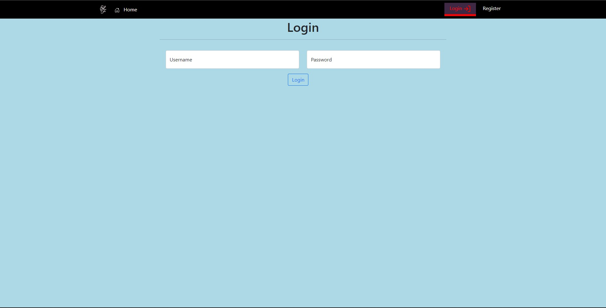
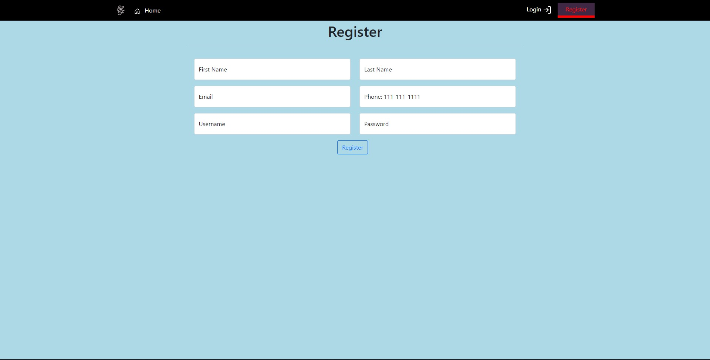
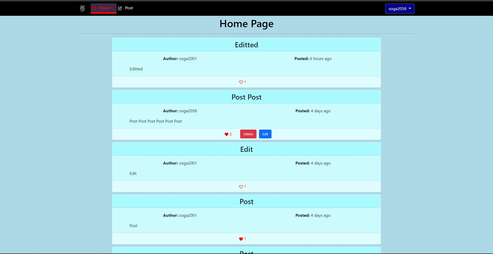
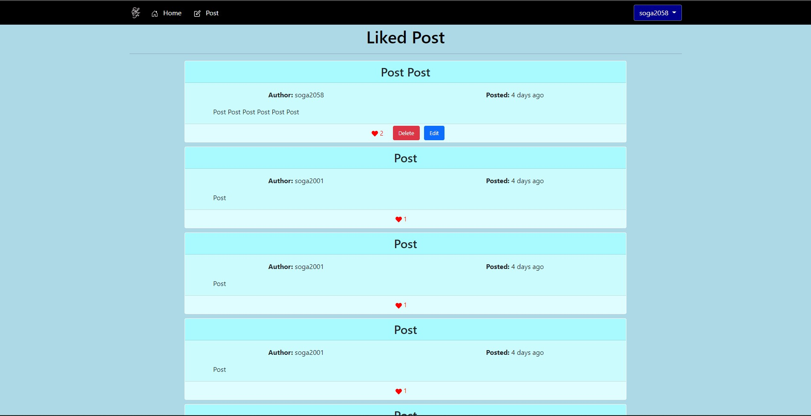

# BasedBook
### Suyogya Poudel and Samyak Ghimire
---
## Requirements

**Python 3.9.5**  
**NodeJS v14.16.1**  
**MongoDB shell version v4.4.6**  

---

## Steps
1. After everything has been installed from **Requirements**, clone this git repository.
2. Create a database called **test_database** and 3 collections called **users**, **post**, and **likes**. Open any terminal and 

        mongosh (opens mongo shell)
        show dbs (prints all the databases on the server)
        use test_database (either creates a dbs called test_database or if its already created, switches to that database)
        show collections (prints all the collection in test_database)
        db.createCollection(users) (creates collection to hold users)
        db.createCollection(post) (creates collection to hold posts)
        db.createCollection(likes) (creates collection to hold likes)
3. Now open the terminal into the Social_Media folder and

        cd back_end (move to the back_end folder)
        pip install virtualenv (install virtualenv for virtual enviornment)
        virtualenv venv (Create a virtual environment)
        source venv/Scripts/activate (on windows) **or** source venv/bin/activate (on mac) (Activate the virtual enviornment)
        pip install -r requirements.txt (install all the requirements to run the backend part of this project)
4. To run the backend, do

        export FLASK_DEBUG=1
        export FLASK_ENV=development
        export FLASK_APP=app.py
        flask run
    This should run the backend
5. Now to move onto the front end

        cd .. (move one folder back)
        cd front_end (move to the front end folder)
        npm i (install all the dependencies)
        npm start (run the front end)
    After a few seconds, a window on your default web browser should open with the front end.

---

## Images

### Home Page

## Login Page

## Register Page

## Logged In Menu

### Home Page when logged in

## Post page

## User Profile

## User Profile

## User Liked

